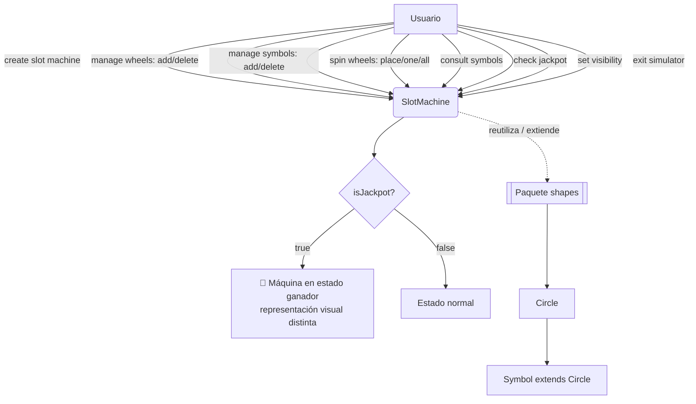
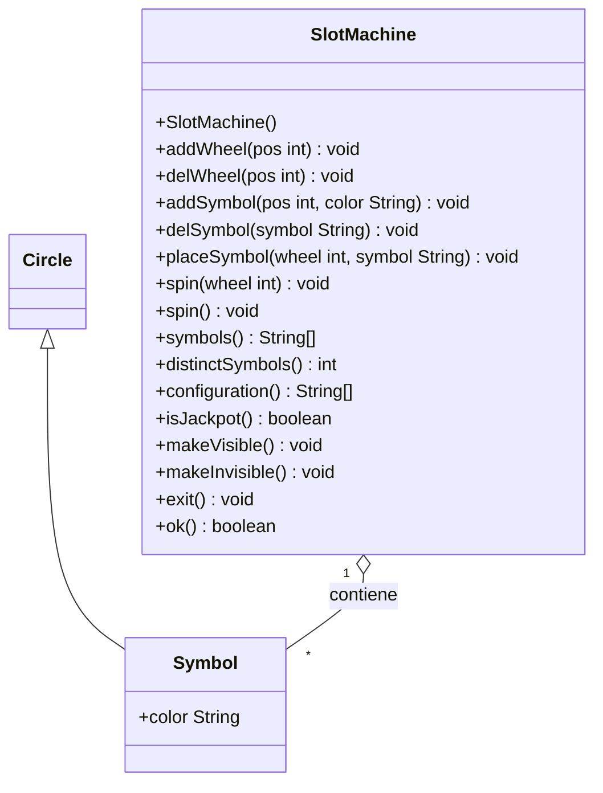

<div align="center">

El link de oneDrive lo utilizamos para guardar el astah y el documento word de respaldo.
https://pruebacorreoescuelaingeduco-my.sharepoint.com/:f:/r/personal/pablo_gualdron-l_mail_escuelaing_edu_co/Documents/proyecto1%20DOPO?d=w4c797642b0d9485189e7c813519d1ef8&csf=1&web=1&e=LxEJe3

# 🎰 slotMachine

### Simulador de Máquina Tragamonedas — DOPO-POOB 2026-2

*Inspirado en el Problema I "Slot Machine" — ICPC World Finals 2025, Baku*


```
   ┌───┐ ┌───┐ ┌───┐
   │ 🔴 │ │ 🟢 │ │ 🔵 │   ← ruedas con símbolos de colores
   └───┘ └───┘ └───┘
     ┃      ┃      ┃
   girar  girar  girar   →  ¿jackpot? 🎉
```

</div>

---

## 📌 Descripción General

**slotMachine** es un simulador orientado a objetos de una máquina tragamonedas de `n` ruedas, donde cada rueda contiene símbolos identificados **por color** (estándar CSS). El objetivo del Ciclo 1 es construir el **motor de simulación completo** —no resolver el problema competitivo de la maratón, sino sentar la base extensible sobre la cual, en ciclos futuros, se implementará la estrategia de juego descrita en el Problema I.

> 💡 **Nota:** Este proyecto reutiliza y extiende el paquete `shapes` (provisto por la Escuela), construyendo los símbolos de la rueda como figuras (`Symbol extends Circle`) coloreadas.

> ⚠️ **Importante:** El requisito implícito de **extensibilidad** rige todo el diseño: nuevas formas de símbolo, nuevas reglas de giro o nuevas visualizaciones deben poder añadirse sin reescribir la clase principal.

---

## 📂 Estructura del Repositorio

```
DOPOG01/
└── Laboratorios/
    └── slotMachine/
        ├── SlotMachine.java          # Clase principal — orquesta ruedas y reglas del juego
        ├── shapes/                    # Paquete base reutilizado y extendido
        │   ├── Circle.java
        │   ├── Symbol.java            # extends Circle — símbolo coloreado individual
        │   └── ...
        ├── docs/                      # Javadoc generado
        └── README.md
```

---

## 🧩 Componentes / Explicación Técnica

### 📄 Documento 1 — `Problema_I_Maquina_Tragamonedas.pdf` (ICPC 2025)

Define el problema competitivo original:

- Una máquina de `n` ruedas (3 ≤ n ≤ 50), cada una con `n` símbolos distintos en el mismo orden.
- El jugador **gira ruedas en secreto** (`girar rueda i, j posiciones`; `j` negativo invierte el sentido).
- Una "amiga" reporta, ronda a ronda, cuántos símbolos **distintos** son visibles (`k`).
- El objetivo competitivo es lograr `k = 1` (jackpot) en ≤ 10 000 acciones, **sin ver directamente las ruedas**.

Este documento es la **inspiración temática**, no el alcance de esta entrega: el algoritmo de resolución (adivinar/ganar con información parcial) queda para ciclos posteriores.

### 📄 Documento 2 — `_DOPO-I01-2026-02.pdf` (Especificación del Ciclo 1)

Traduce el problema anterior en un **simulador visual e interactivo**, con la clase principal `SlotMachine` y sus requisitos formales:

| Requisito funcional | Método asociado |
|---|---|
| Crear la máquina | `SlotMachine()` |
| Adicionar/eliminar rueda | `addWheel(pos)` / `delWheel(pos)` |
| Adicionar/eliminar símbolo | `addSymbol(pos, color)` / `delSymbol(symbol)` |
| Girar ruedas | `placeSymbol(...)`, `spin(wheel)`, `spin()` |
| Consultar símbolos | `symbols()`, `distinctSymbols()`, `configuration()` |
| Consultar jackpot | `isJackpot()` |
| Visibilidad | `makeVisible()` / `makeInvisible()` |
| Terminar | `exit()` |
| Estado de última operación | `ok()` |

**Reglas de diseño clave:**
- Los símbolos se identifican por **colores CSS estándar**.
- Posiciones indexadas desde **1**; fuera de rango se ajustan al límite más cercano (mínimo o máximo).
- `symbols()` retorna los colores de una rueda en orden desde la posición 1.
- `configuration()` retorna los colores visibles en **todas** las ruedas, de izquierda a derecha.
- Errores se comunican vía `JOptionPane`, **solo si el simulador está visible**.

---

## 🛠️ Flujo de Trabajo / Diagrama Visual





---

## 🚀 Guía de Inicio Rápido

### Requisitos previos

- **BlueJ** (IDE obligatorio según especificación).
- **JDK 8+**.
- Paquete `shapes` disponible en el proyecto.

### Pasos

```bash
# 1. Clonar el repositorio
git clone <url-del-repositorio>
cd DOPOG01/Laboratorios/slotMachine

# 2. Abrir el proyecto en BlueJ
#    File > Open Project > seleccionar carpeta slotMachine

# 3. Compilar todas las clases desde BlueJ (Compile All)

# 4. Crear un objeto SlotMachine desde el panel de objetos
#    y ejecutar los métodos públicos interactivamente
```

> 💡 **Nota:** BlueJ permite invocar cada método público (`addWheel`, `spin`, `isJackpot`, etc.) directamente desde el menú contextual del objeto, ideal para probar el comportamiento sin escribir un `main`.

---

## 💡 Conceptos Clave Aprendidos

- **Reutilización por herencia:** `Symbol extends Circle` aprovecha el paquete `shapes` sin duplicar lógica geométrica.
- **Diseño por contrato con `ok()`:** patrón que reporta el éxito/fallo de la última operación, común en interfaces educativas antes de introducir excepciones.
- **Separación simulador vs. algoritmo:** el Ciclo 1 construye el *motor*; la *estrategia de resolución* (inspirada en el problema ICPC) se aborda en ciclos posteriores — buena práctica de diseño incremental (mini-ciclos).
- **Extensibilidad como requisito no funcional:** el diseño anticipa nuevas formas de símbolo o reglas de giro sin modificar la clase principal.
- **Interacción visible/invisible:** el simulador debe soportar modo "headless", útil para pruebas automatizadas (TDD/BDD).

---

*README.md generados automáticamente por Claude.*
